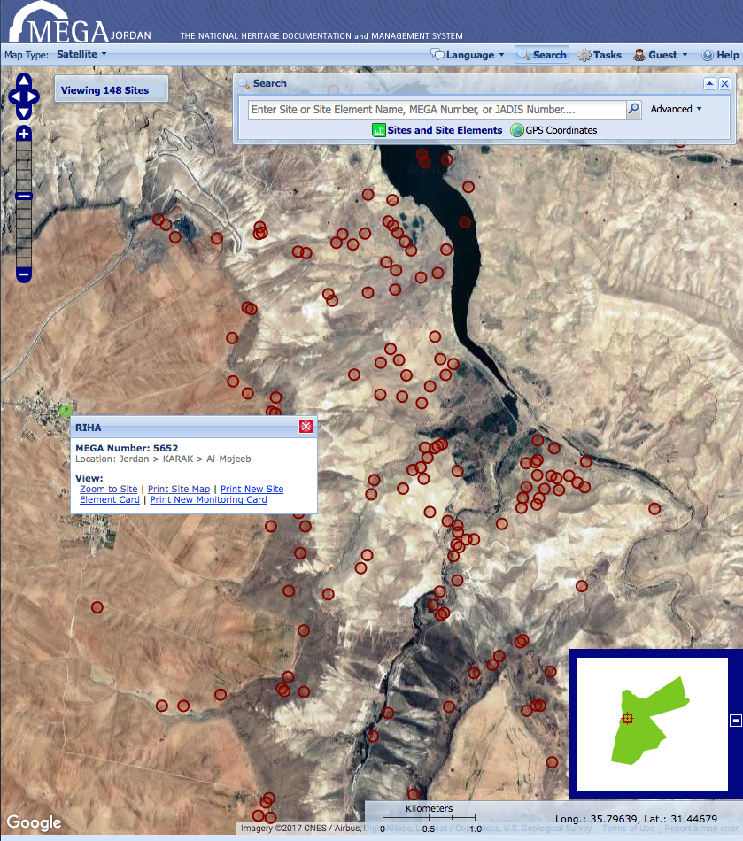
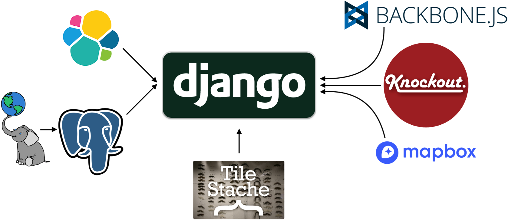

title: Django Meetup - Arches
class: animation-fade
layout: true

<!-- This slide will serve as the base layout for all your slides -->
.bottom-bar[
   a look under the hood of a platform that allows the deployment of custom apps without writing code
]

---

class: impact


## a look under the hood of a platform that allows the deployment of custom apps without writing code
## Nov. 29, 2017, Django Meetup

---
<!-- Adam -->

## Farallon Geographics
.row[
.col-4[
[](http://www.fargeo.com)
]
.col-8[
- Focus on Geospatial
- Business Analysis/Needs Assessment
- Web, Mobile, Desktop Solutions Developers
]
]

## Today's Team
.row[
.col-2[

]
.col-4.bio.big[
Jeff Munowitch <!-- GIS Generalist, Web Developer -->
]
.col-2[

]
.col-4.bio.big[
Rob Gaston <!-- Master Front-end Developer, but really also quite good at everything else -->
]
]

---

<!-- Adam -->
# What we want from this talk

.big[
- Show off Arches
- Solicit Ideas and Technical Improvements
- Grow the Community by getting more people deploying, using, developing on and knowing about Arches
]

---

## What is Arches?



.small[
- Backstory
  - Data management system adaptable to disparate cultural heritage datasets
  - Funded by the Getty Conservation Institute and World Monuments Fund

- Outcome
  - An open-source platform for building geospatial applications
  - Designed for cultural heritage, but widely applicable to other use cases
]

---

## What Arches Provides

.big[
- A user interface to develop graph data models
- Keyword, temporal, & geospatial search tools
- Shared thesaurus management
- Geospatial vector tile caching/services via TileStache
- A means of extension through custom widgets (forms & reports) and datatypes
]

---
<!-- Jeff -->
## Technology Stack



---

<!-- Rob -->

# Arches in action

.big[
As a business system, Arches has three main purposes:

1. Data discovery and visualization
2. Data management
3. Data integration and analysis
]

---
<!-- Ryan -->
# How Arches Does it with Django

- Standard MVT Pattern
- Django ORM for Data Access
- Class Based Views and Template Inheritance
- Code first approach to data modeling using migrations
- Language localization
- Standard Django User Authentication with custom additions
- Django Projects

---

## Security

.big[
- In Arches permissions are managed in the Arches Permissions Manager and in the Django admin interface.
- django-guardian to have per object permissions
- Arches utilizes both Django-included and custom password validators. Extends default validators to use custom help text.
]

---

class: geojson

```py
AUTH_PASSWORD_VALIDATORS = [
    {
        'NAME': 'arches.app.utils.password_validation.NumericPasswordValidator',
    },
    {
        'NAME': 'arches.app.utils.password_validation.SpecialCharacterValidator',
        'OPTIONS': {
            'special_characters': ('!','@','#',')','(','*','&','^','%','$'),
        }
    },
    {
        'NAME': 'arches.app.utils.password_validation.HasNumericCharacterValidator',
    },
    {
        'NAME': 'arches.app.utils.password_validation.HasUpperAndLowerCaseValidator',
    },
    {
        'NAME': 'arches.app.utils.password_validation.MinLengthValidator',
        'OPTIONS': {
            'min_length': 9,
        }
    },
]
```

---

## Localization

.big[
- MegaJ included localization to Arabic, but using .NET framework
- Arches developers can easily internationalize static content with Django
- Internationalization allows Arches to be instantly ready for localization
]

---

## Project Paradigm

.big[
- Arches itself designed to be customized - not just the data model
- We created a command, inspired by Django, to deploy the framework of your own Arches project
- Allows implementors to create and modify their app without overwriting core Arches code
]

---

## Lessons Learned

.big[
- Be careful with migrations:
  - Do not call management commands 
  - Name migration files appropriately
- Keep up on dependency versions
- Deployment struggles of potential implementors
]

---

# Future Challenges

.big[
- Ongoing Community Building
- Containerization in Production/Development
- Python 3/Django 2
- Providing more off the shelf solutions to aid adoption
  - Resource Models, Branches, Widgets, Functions, Datatypes, Reports etc.
]

---

class: impact

# Thanks! Questions?